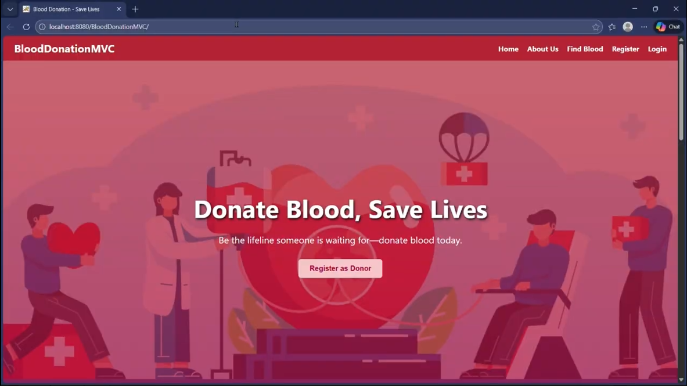
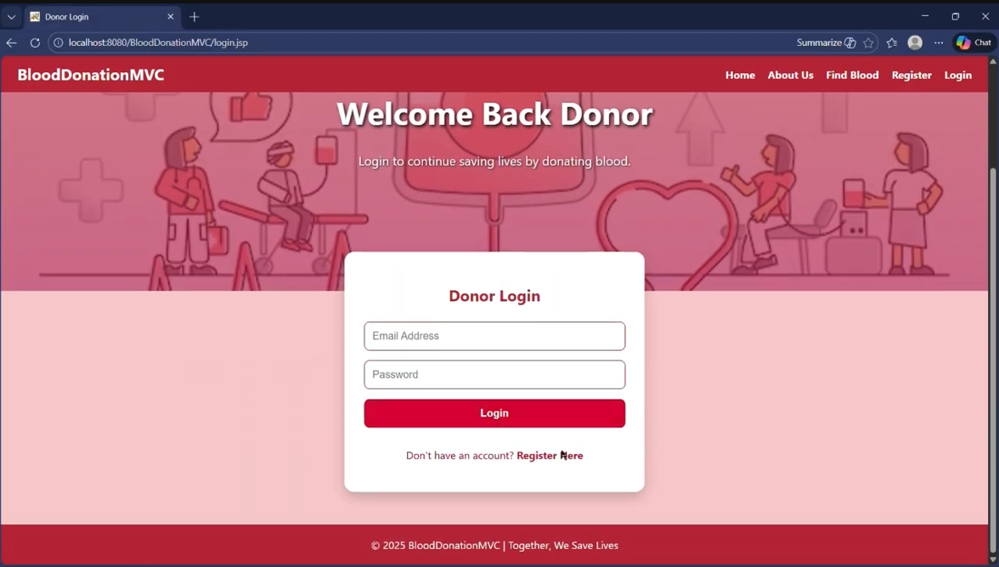
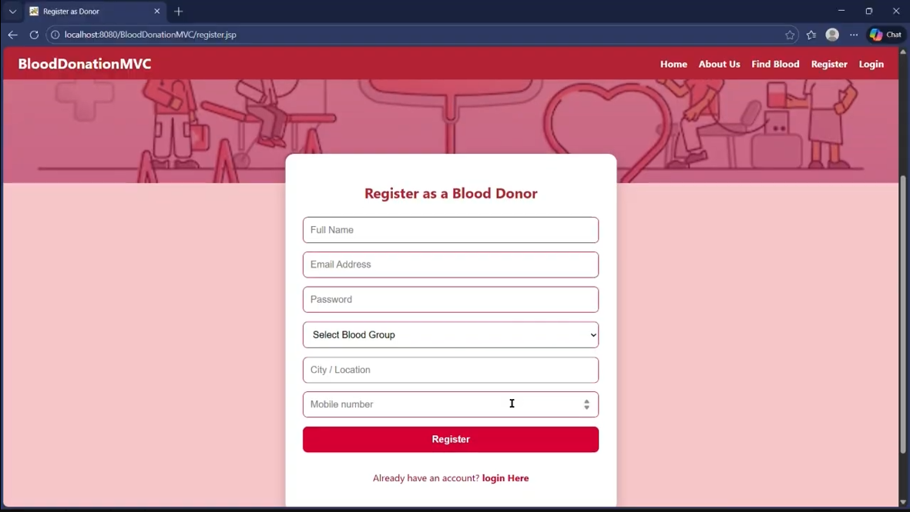
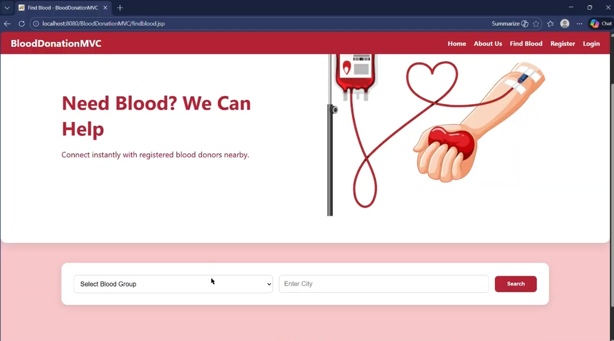
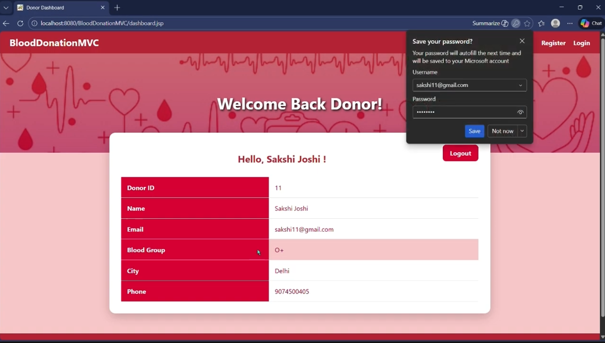
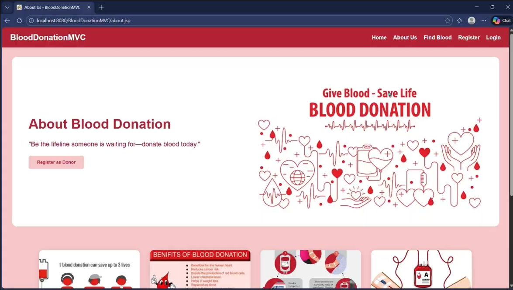

Project Name: BloodDonationMVC

Description
BloodDonationMVC is a simple web-based Blood Donation Management System built as an academic project using the MVC pattern. It demonstrates JSP, Servlets, JDBC, and MySQL to provide donor registration, user authentication, and donor search by blood group and city.

Technologies
- Frontend: HTML, JSP, CSS
- Backend: Java (Servlets, JDBC)
- Database: MySQL
- Server: Apache Tomcat
- IDE: NetBeans

Project Structure (quick)
- `src/` — Java source code (controller, model, dto, db)
- `web/` — HTML/JSP pages, `WEB-INF` and `META-INF` configuration
- `images/` — static image assets used by the site (logos, banners, placeholders)
- `lib/` — third-party libraries (e.g. MySQL connector)
- `database/` — SQL dump: `blooddonation.sql`

Main Features
- Donor registration and profile storage
- User login and session handling
- Search donors by blood group and city
- Simple MVC separation of concerns

Using the `images/` folder
- Add or replace site images in the `images/` folder.
- Reference images from your HTML/JSP using relative paths, for example:

```html

```

If your pages are served from the web root (the `web/` folder in this project), the path above works as-is. If you move files, adjust the relative path accordingly.

How to run (quick)
1. Install JDK (recommended 17+)
2. Install and start MySQL and import `database/blooddonation.sql`
3. Configure database credentials in `src/java/db/DBConnector.java`
4. Deploy the project to Apache Tomcat (or import into NetBeans and Run)
5. Open the site root (e.g., `index.html` or `login.jsp`) in a browser

Database
- Database name (example): `blood_donation`
- Main table: `donors`

Screenshots
- Home page


- Login page


- Registration page


- Find donors


- User profile


- About page



Notes
This repository is for academic purposes and demonstrates basic CRUD, authentication, and MVC concepts. 
  